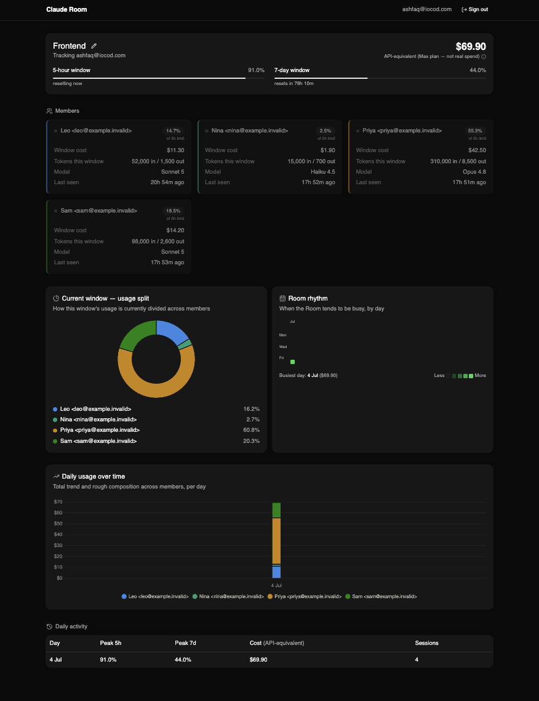
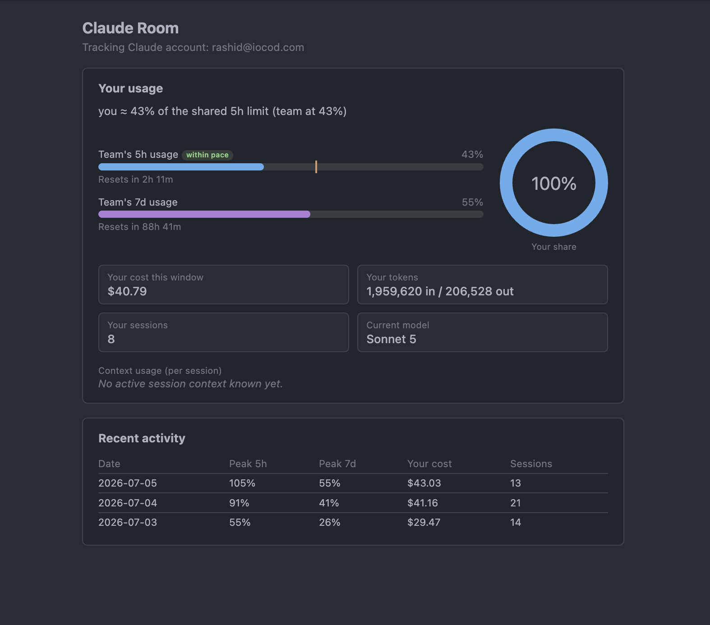
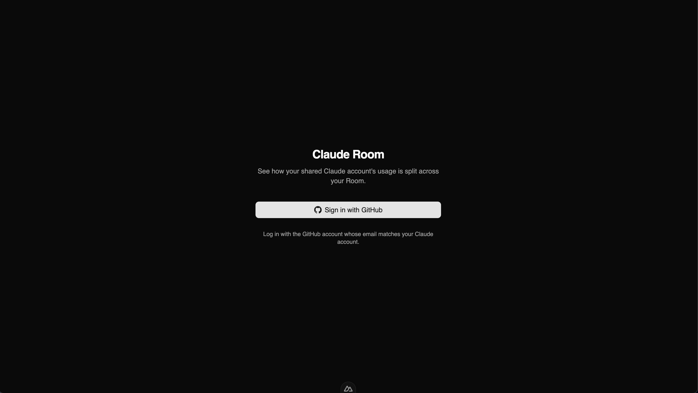

# Claude Room

*(package name: `claude-team-usage` — the product is branded "Claude Room" in the
extension panel and dashboard UI; the underlying repo/extension name hasn't been
renamed to match yet.)*

Splits a shared Claude Max/Team account's usage limits across the people actually
using it, so each **Room member** sees their own real share instead of one blended
number.

<!-- SCREENSHOT: the Room owner's dashboard (dashboard.vue / RoomView.vue) - header with 5h/7d bars, member grid with per-member slices, insights strip, daily activity table -->


## The problem

When several people share one Claude Max/Team account, Claude Code's status line
only ever reports one combined 5-hour and 7-day usage percentage — the same number
on every machine, with no way to tell whose sessions are actually driving it. This
project derives that missing breakdown: each **Room member's** estimated share of
the account's shared limits, tracked over time.

## How it works

1. **Status-line hook** (`extension/media/usage-logger.js`) — runs as Claude Code's
   status-line command on every render. Reads the official `rate_limits` and `cost`
   fields Claude Code exposes and appends changes to a local log
   (`~/.claude/team-usage/local-log.jsonl`). No network calls happen here.
2. **VS Code extension** (`extension/`) — wires the hook into
   `~/.claude/settings.json` automatically, reads the local log, and shows the Room
   member their own usage (status bar + a "Claude Room" panel). Works fully
   offline/local even with sync disabled.
3. **Optional Supabase sync** — the extension also uploads aggregate snapshots to a
   shared Supabase project, stamped with the Claude account's email (the "Room"
   key). Writes are insert-only; the only thing the shipped key can read back is an
   aggregates-only RPC (see [What data is collected](#what-data-is-collected)).
4. **Owner dashboard** (`dashboard/`, Nuxt 4) — the Room owner signs in with GitHub;
   the server matches the verified login email against the Room's Claude account
   email and shows only that Room's members, slices, and daily history. The
   Supabase **secret** key lives server-side only and never reaches the browser.

<!-- SCREENSHOT: the VS Code extension's status bar item and "Claude Room" webview panel showing a member's own 5h/7d bars, slice, and recent activity -->


## What data is collected

**Locally only**, in `~/.claude/team-usage/local-log.jsonl` (never leaves the
machine unless sync is enabled): cost, token counts, 5h/7d percentages and reset
timestamps, per-session context-usage percentage, model name, session id, and
timestamp. The status-line hook itself makes no network calls.

**Synced to Supabase** (only if `claudeUsage.supabaseUrl` /
`claudeUsage.supabaseAnonKey` are set — on by default, pointing at the shared
Room's project): one row per changed snapshot in `usage_snapshots`, with exactly
these columns: `user_name`, `machine`, `session_id`, `cost_usd`, `five_hour_pct`,
`five_hour_resets_at`, `seven_day_pct`, `seven_day_resets_at`, `model`,
`input_tokens`, `output_tokens`, `context_used_pct`, `recorded_at`, and
`account_email` (the Claude account email, used to group snapshots into a Room).

**Never collected or transmitted, by design:** prompts, code, file contents, file
paths, or anything else from your conversations or workspace.

The shipped publishable/anon key is deliberately limited: Row-Level Security grants
it **INSERT only** on `usage_snapshots` (no SELECT/UPDATE/DELETE), and the only
function it can execute (`get_team_window_summary()`) returns aggregated per-user
totals for the current window — never a raw row. The Room-scoped equivalent used by
the dashboard (`get_room_window_summary()`) and the raw table itself are reachable
only with the Supabase **secret** key, which lives on the dashboard server and is
never shipped in the extension. Full field-by-field detail: [DATA_SOURCES.md](DATA_SOURCES.md).

## Repository structure

```
claude-team-usage/
  extension/          VS Code extension — the status-line hook, local usage panel, Supabase sync
  dashboard/          Nuxt 4 app — GitHub-authenticated owner dashboard + /admin Room switcher
  supabase/schema.sql  source of truth for the DB schema, RLS policies, and RPCs
  docs/screenshots/    images referenced by this README
  CONTEXT.md           architectural decisions (data source, delta math, Room model)
  DATA_SOURCES.md      exact fields used/ignored, plus every known edge case and how it's handled
  PROJECT_STATUS.md    narrative build history and open items (see note on staleness below)
  BUILD_GUIDE.md / CLAUDE_ROOM_BUILD_GUIDE.md   the phase-by-phase prompts this was built from
```

## Install (for a Room member)

1. Download the `.vsix` from the repo's
   [Releases page](https://github.com/ashfaqevp/claude-team-usage/releases), or
   build it yourself (see below).
2. In VS Code: Extensions view → `...` menu → **Install from VSIX...** → select the
   file. Or from the command line:
   `code --install-extension claude-team-usage-<version>.vsix`.
3. Reload the window. That's it — **zero manual configuration required.** The
   extension wires the status-line hook into `~/.claude/settings.json` itself, and
   the Room's Supabase URL/key are baked into the extension's defaults.

### Settings

All optional — configure only if you want to override a default.

| Setting | Default | Purpose |
|---|---|---|
| `claudeUsage.supabaseUrl` | shared Room's project URL | Where snapshots sync to. Empty disables sync. |
| `claudeUsage.supabaseAnonKey` | shared Room's publishable key | Insert-only, aggregates-only key. Empty disables sync. |
| `claudeUsage.userNameOverride` | *(empty)* | Label shown in shared usage data. Leave empty to auto-derive from your git identity (or a generated device id if git isn't configured). |

More detail on identity resolution and sync behavior: [extension/README.md](extension/README.md).

## Dashboard (for the Room owner)

```bash
cd dashboard
pnpm install
```

Create `dashboard/.env` (gitignored) with:
```
SUPABASE_URL=...
SUPABASE_SECRET_KEY=...
SUPABASE_PUBLISHABLE_KEY=...
```
`SUPABASE_SECRET_KEY` is read only in server-side routes (`server/api/*.ts`) via
Nitro's `runtimeConfig` — it is never sent to the browser.
`SUPABASE_PUBLISHABLE_KEY` is used client-side only for the GitHub sign-in flow.

```bash
pnpm dev
```

Sign in with the GitHub account whose **verified email matches the Room's Claude
account email** — that match is the entire authorization for `/`, the owner page.
A separate `/admin` page (allowlisted by email in the `admins` table) can open any
Room's view. Setting up the GitHub OAuth provider in Supabase is a one-time
prerequisite; see [dashboard/CLAUDE.md](dashboard/CLAUDE.md) for the full
architecture and auth flow.

<!-- SCREENSHOT: dashboard sign-in screen (SignInScreen.vue) prompting GitHub login -->


## Build the .vsix from source

```bash
cd extension
pnpm install
pnpm dlx @vscode/vsce package
```

Produces `claude-team-usage-<version>.vsix` in `extension/`.

## Requirements

- **Claude Code v1.2.80 or newer** — the `rate_limits` field in the status-line
  payload doesn't exist before this version.
- **Node.js** (for building the extension/dashboard; pnpm is the package manager
  used throughout — do not use npm/yarn in either subproject).
- Capture only happens where Claude Code actually draws a status line — i.e.
  terminal sessions, including VS Code's integrated terminal. A surface with no
  status line (or a Claude Code version predating `rate_limits`) contributes
  nothing, silently.

## Limitations (honest)

- **The per-person split is an estimate, not an official figure.** The account-wide
  5h/7d percentage is exact — it comes straight from Anthropic. The *split between
  people* is derived from each person's cost share within the window
  (`your_slice ≈ (your window_cost / everyone's window_cost) × account_five_hour_pct`),
  because Anthropic doesn't expose a true per-person breakdown on a shared account.
- **claude.ai web chat usage is invisible here.** It draws from the same shared 5h/7d
  pool (the account total still reflects it correctly) but has no status line, so
  it's never attributed to any Room member's card — visible slices can sum to less
  than the real account total if someone is also chatting via the browser.
- **Schema-version risk.** Everything here parses Claude Code's status-line JSON by
  field name. If a future Claude Code release renames or restructures fields
  (especially under `rate_limits` or `cost`), rebuild the extension and re-run its
  test suite (`pnpm test` in `extension/`) against a fresh sample payload before
  trusting the numbers again — a schema change degrades to missing/zero numbers
  rather than a crash, but won't necessarily look obviously wrong.

## Status / roadmap

The single-Room engine (logger → local log → Supabase sync → dashboard → packaged
`.vsix`) is built, tested, and verified end-to-end, including delta-based cost and
token accounting and several fixed edge cases documented in
[DATA_SOURCES.md](DATA_SOURCES.md). On top of that, the multi-Room model described
in [CLAUDE_ROOM_BUILD_GUIDE.md](CLAUDE_ROOM_BUILD_GUIDE.md) is also implemented: a
Room is keyed by the Claude account's email (`account_email`), the extension stamps
every synced snapshot with it, and the dashboard has GitHub-authenticated
Room-scoped owner access (`/`) plus an allowlisted admin view (`/admin`) that can
open any Room.

Documented, deliberately deferred items (see the build guide's "Future hardening"
section):
- Authenticated, Room-scoped inserts — writes are currently insert-only via a
  shared publishable key, acceptable for internal use but not access-controlled.
- A Google (or other provider) login option alongside GitHub.
- `CLAUDE_CONFIG_DIR` guidance for anyone running a personal Claude account on the
  same machine as their Room account.
- A timestamp-plausibility check to catch a valid-but-wrong `recorded_at` (e.g. an
  accidental epoch date) — see edge cases 10 and 12 in
  [DATA_SOURCES.md](DATA_SOURCES.md).

**Note on the older status docs:** `PROJECT_STATUS.md` and parts of `CONTEXT.md`
describe GitHub login, Room-scoped reads, and the admin dashboard as not-yet-built
"Open items." That's now out of date — those were built after `PROJECT_STATUS.md`
was last updated. Treat this README and `CLAUDE_ROOM_BUILD_GUIDE.md` as the current
source of truth on what's actually shipped.

## License

TODO — no LICENSE file exists in this repo yet.

---

## Screenshots to add

- `docs/screenshots/dashboard-overview.png` — the Room owner's dashboard: header
  with 5h/7d bars + reset countdowns, member grid (slice/cost/tokens/model/last-seen),
  insights strip, daily activity table.
- `docs/screenshots/extension-panel.png` — the VS Code status bar item plus the
  "Claude Room" webview panel (5h/7d bars, your slice, recent activity).
- `docs/screenshots/dashboard-signin.png` — the dashboard's GitHub sign-in screen.
